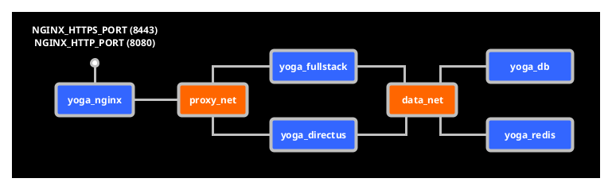
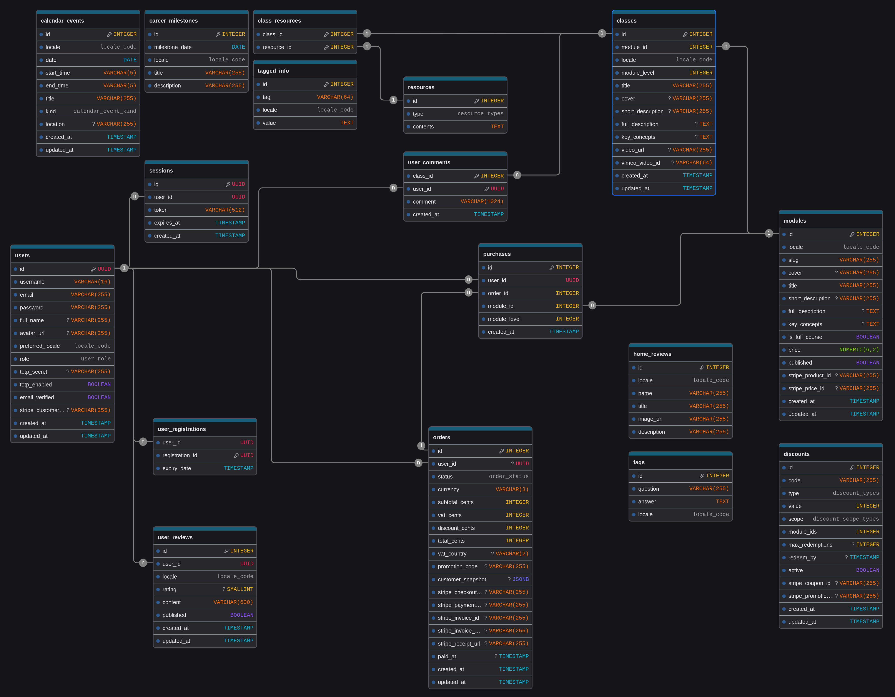

*This project has been created as part of the 42 curriculum by dsoriano, ravazque, marcoga2, mvassall.*

---

# Transcend Yoga — ft_transcendence

## Description

**Transcend Yoga** is a commercial e-learning platform about the history and practice of yoga, developed for a real client (Ananda). It fulfils the **V.6 Specialized Projects – Education Platform / Course Catalogue** variant of the ft_transcendence subject.

The platform lets users browse, purchase and watch yoga course modules through a protected video player, manage their account and purchases, and interact with the platform in three languages. All editorial content is managed by the client through a headless CMS without developer intervention.

### Key Features

- Full-stack SSR application (Nuxt 4 + Nitro) with ~35 server routes
- Purchase and access control for course modules via Stripe Checkout
- Vimeo gated playback — video access enforced per-purchase server-side
- Headless CMS (Directus) for non-technical content management
- Authentication with Argon2id, JWT in `HttpOnly` cookies, Google OAuth 2.0 and 2FA TOTP
- Public REST API under `/api/v1` with API-key auth, rate limiting and OpenAPI docs
- Multilanguage support (English, Spanish, French) with per-locale editorial content
- GDPR-compliant data export and account erasure with confirmation emails
- WAF (ModSecurity + OWASP CRS 4.x) in front of all traffic via Nginx

---

## Team Information

| Login | Role | Responsibilities |
|---|---|---|
| **ravazque** | Tech Lead / Backend Lead | Overall architecture, Nuxt 4 server setup, all ~35 API endpoints, authentication backend (Argon2id + JWT), Stripe integration, transactional mailing, public `/api/v1` REST API, GDPR endpoints, Redis rate-limiting, Docker `/api/health`, project coordination |
| **marcoga2** | Frontend Lead / UX | All Nuxt 4 frontend pages (home, modules, lesson, profile), SSR page rendering, VimeoPlayer component, multilanguage UI (LangSwitcher), custom design system (10+ components), notification toast system, advanced catalogue browsing (filters, level-based progression, purchase indicators) |
| **mvassall** | Database Architect / Auth Engineer | Prisma schema design (17 models, enums, relations), Google OAuth 2.0 implementation, 2FA TOTP, database security model, hybrid UUID/integer key strategy |
| **dsoriano** | CMS Lead | Directus 11 integration on the shared Postgres instance, collection structure and access policies, dual-write calendar (CMS + web modal), CMS onboarding documentation |

---

## Project Management

### Task Distribution

Work was divided into four vertical tracks aligned with team-member ownership: backend + payments + mailing (ravazque), frontend + UX (marcoga2), database + authentication providers (mvassall) and CMS (dsoriano). Tracks ran in parallel after the initial schema was agreed upon collectively, minimising blocking dependencies.

### Tools Used

- **GitHub** — version control, branch-based feature workflow, pull-request reviews
- **drawDB** — database table design and visualization. 

### Workflow

Weekly sync meetings at the start of each sprint to agree on priorities. Each feature was implemented on a dedicated branch and reviewed before merging to `main`. The database schema (`prisma/schema.prisma`) was the shared contract — any schema change required team agreement before merging.

---

## Instructions

### Prerequisites

| Requirement | Minimum version |
|---|---|
| Docker Engine | 24.x |
| Docker Compose plugin | v2.x |
| `make` | any recent version |
| OpenSSL | for self-signed cert generation |

No local Node.js installation is needed — everything runs inside Docker.

### Environment Setup

1. Clone the repository:
   ```bash
   git clone <repo-url> && cd Transcend-Yoga
   ```

2. Build and start the stack:
   ```bash
   make all
   ```
   `make all` copies `srcs/.env.example` to `srcs/.env`, injects your host UID/GID, generates the self-signed TLS certificate, builds the Docker images and starts every service. It does **not** install system packages — Docker, Docker Compose and OpenSSL must already be present on the host.

3. Open `srcs/.env` and fill in the secrets you need:

   ```env
   POSTGRES_USER=yoga
   POSTGRES_PASSWORD=<strong-password>
   POSTGRES_DB=yoga_db

   JWT_SECRET=<random-64-char-string>

   # Stripe (leave blank for local dev without payments)
   STRIPE_SECRET_KEY=sk_test_...
   STRIPE_PUBLIC_KEY=pk_test_...
   STRIPE_WEBHOOK_SECRET=whsec_...

   # Google OAuth (optional)
   GOOGLE_CLIENT_ID=
   GOOGLE_CLIENT_SECRET=

   # SMTP (leave blank to print verification codes in logs only)
   SMTP_HOST=smtp.gmail.com
   SMTP_PORT=587
   SMTP_USER=your@gmail.com
   SMTP_PASSWORD=<app-password>
   SMTP_FROM="Yoga con Marco <your@gmail.com>"

   # Vimeo (leave blank — gated playback returns 503 until configured)
   VIMEO_ACCESS_TOKEN=

   # Public /api/v1 (leave blank to keep write endpoints disabled)
   API_KEY=

   # Directus CMS
   DIRECTUS_ADMIN_EMAIL=admin@yoga.local
   DIRECTUS_ADMIN_PASSWORD=<strong-password>
   ```

### First-Time Run

```bash
make all        # build + start
make seed       # load editorial catalogue (idempotent)
make test       # create demo + tester accounts (idempotent)
```

The application is then available at **`https://localhost:8443`**.
The Directus admin panel is at **`https://localhost:8443/cms`**.
Public API docs (JSON OpenAPI 3.1) at **`https://localhost:8443/api/v1/docs`**.

Accept the browser warning for the self-signed certificate.

### Deployed Containers and Networks



### Day-to-Day Commands

```bash
make up                 # start
make down               # stop
make restart            # stop + start
make logs               # all services
make logs-fullstack     # Nuxt only
make status             # docker compose ps
make seed               # reload editorial catalogue
make test               # reload demo + tester users
make preview            # production build served on http://localhost:3000 (no SSL)
make vimeo-check        # smoke-test /api/health and Vimeo proxy (IV.9 healthcheck)
make api                # smoke-test the Public API key gate (IV.1)
make directus-snapshot  # save Directus schema
make directus-apply     # load Directus schema
make clean              # stop + wipe volumes (DB)
make fclean             # clean + remove images
make re                 # fclean + all
```

### Stripe Webhook (local dev)

Install the Stripe CLI and run it alongside the stack:

```bash
stripe listen --forward-to https://localhost:8443/api/stripe/webhook --skip-verify
```

Copy the printed `whsec_…` value to `STRIPE_WEBHOOK_SECRET` in `.env`, then `make restart`.

---

## Technical Stack

### Frontend

| Technology | Role |
|---|---|
| **Nuxt 4** (Vue 3) | Full-stack framework, SSR, file-based routing |
| **Nuxt UI v4** | Component primitives (buttons, modals, forms) |
| **Tailwind CSS v4** | Utility-first styling |
| **Custom design system** | 10+ bespoke components on top of Nuxt UI |

### Backend

| Technology | Role |
|---|---|
| **Nitro** (bundled with Nuxt 4) | Server-side API routes (`server/api/`) |
| **Argon2id** | Password hashing |
| **JWT (HS256)** | Session tokens in `HttpOnly; Secure; SameSite=Strict` cookies |
| **Redis 7** | Sliding-window rate limiting on auth and `/api/v1` endpoints |
| **Nodemailer** | Transactional email (verification codes, purchase + GDPR confirmation) |
| **otplib + qrcode** | 2FA TOTP generation and QR enrollment |
| **Zod** | Runtime validation for request payloads |

### Database

| Technology | Role |
|---|---|
| **PostgreSQL 17** | Primary relational database |
| **Prisma 5** | ORM — schema, migrations, type-safe client |
| **uuid-ossp / pgcrypto** | UUID generation and crypto extensions |

**Why PostgreSQL?** The client's existing content data was already structured as relational tables. PostgreSQL's strong consistency guarantees, support for `uuid-ossp` and native Directus compatibility made it the only sensible choice. The hybrid UUID/integer primary-key strategy (UUID for auth models, serial INT for content models) aligns with both Stripe's requirements and Directus's constraint on composite PKs.

### Infrastructure

| Technology | Role |
|---|---|
| **Docker Compose** | Service orchestration (5 containers) |
| **Nginx + ModSecurity** | Reverse proxy, TLS termination, WAF (OWASP CRS 4.x) |
| **Directus 11** | Headless CMS — reads/writes Postgres tables directly |
| **Redis 7** | Shared cache between fullstack and Directus |

**Network isolation:** two Docker networks (`proxy_net`, `data_net`). Only Nginx exposes ports 443 and 80 externally. All other services are internal only.

### Why Nuxt 4 (full-stack)?

Running frontend and backend in the same Nuxt process eliminates the cross-container HTTP round-trip on SSR requests. Session cookies and `Accept-Language` headers are available server-side at page render time, so routes like `/modules` or `/profile` arrive fully hydrated without a client-side loading state.

---

## Database Schema

### Overview

The schema uses a hybrid key strategy: `User`, `Session`, and `UserRegistration` use UUID primary keys (non-enumerable, appropriate for auth); all content and commerce models use serial integer PKs (compatible with Directus introspection, which does not support composite PKs).

Prices and monetary values are stored as integers in **cents** — the Stripe convention — to avoid floating-point rounding errors.

All editorial content (modules, classes, FAQs, career milestones, UI strings) is duplicated per locale (`en_en`, `es_es`, `fr_fr`) in the same tables. Endpoints filter by `?locale=`.

<br>



<br>

### Entity Relationships

### Key Tables

| Table | PK type | Key fields |
|---|---|---|
| `users` | UUID | `username`, `email`, `role`, `totp_enabled`, `stripe_customer_id` |
| `sessions` | UUID | `user_id`, `token`, `expires_at` |
| `modules` | INT | `locale`, `slug` (unique pair), `price`, `is_full_course`, `stripe_product_id` |
| `classes` | INT | `module_id`, `locale`, `module_level`, `vimeo_video_id` |
| `orders` | INT | `user_id` (nullable on erasure), `status`, `total_cents`, `vat_cents`, `stripe_checkout_session_id` |
| `purchases` | INT | `user_id + module_id` (unique) — access control source of truth |
| `tagged_info` | INT | `tag + locale` (unique) — all localisable UI text |
| `discounts` | INT | `code` (unique), `stripe_coupon_id` |

**GDPR note:** On account erasure (`DELETE /api/me`), the `users` row is deleted. Orders are retained for fiscal obligations (10-year French requirement) but `user_id` is set to `NULL` and `customer_snapshot` is cleared. Purchases and reviews belonging to the deleted user are cascade-deleted. A confirmation email is sent to the user immediately before erasure.

<br>

## Features List

| Feature | Description | Contributors |
|---|---|---|
| **Registration + email verification** | Two-step signup with a 6-digit code sent by email; argon2id hashed passwords | ravazque, mvassall |
| **Login / logout** | JWT in `HttpOnly` cookie; sliding-window rate limit via Redis | ravazque |
| **Google OAuth 2.0** | Full server-side flow with CSRF state parameter; creates or links account | mvassall |
| **2FA TOTP** | Setup (QR + base32 secret), verify, and disable endpoints; integrates with login flow | mvassall |
| **Password recovery** | Time-limited token via email; argon2id re-hash on reset | ravazque |
| **Profile management** | Update username, full name, avatar URL, preferred locale, change password | ravazque, marcoga2 |
| **Module catalogue** | Browsable list of yoga course modules per locale with progression and access indicators | marcoga2 |
| **Module detail page** | Full description, class list, purchase CTA, per-class access state | marcoga2 |
| **Vimeo gated playback** | Lesson video access gated by purchase; OAuth 2 token refresh; first class of each module free as preview | marcoga2, ravazque |
| **Stripe Checkout** | Session creation, anti-duplicate-charge check, cross-locale purchase resolution | ravazque |
| **Stripe webhook handler** | Processes `checkout.session.completed`, `payment_intent.payment_failed`, `invoice.payment_succeeded`, `invoice.finalized`; idempotent via upsert | ravazque |
| **Bundle pricing** | Server-side bundle price logic (floor, ceiling, proportional credit for prior purchases); editable from Directus | ravazque |
| **Purchase history** | `/api/me/purchases` listing all unlocked modules | ravazque |
| **GDPR data export** | `GET /api/me/export` streams a JSON of all personal data | ravazque |
| **GDPR account erasure** | `DELETE /api/me` with password + literal confirmation; confirmation email sent on completion; orders anonymised, not deleted | ravazque |
| **Public REST API** | `/api/v1` with API-key auth (`X-API-Key`), rate limiting, OpenAPI 3.1 docs, GET/POST/PUT/DELETE | ravazque |
| **Directus CMS** | Content editor for modules, classes, FAQs, calendar, reviews, UI strings, discounts | dsoriano |
| **Multilanguage (ES/EN/FR)** | All editorial content per locale; locale resolved from query → cookie → `Accept-Language`; `LangSwitcher.vue` | marcoga2 |
| **Calendar events** | Weekly schedule of live and in-person classes; editable from CMS or web modal | dsoriano, ravazque |
| **Custom design system** | 10+ bespoke components (player, module card, calendar, notification toasts, lang switcher, etc.) | marcoga2 |
| **Notification system** | Toast notifications on every create / update / delete action across the platform | marcoga2 |
| **Docker infrastructure** | Two isolated networks, 5 services, TLS termination, WAF, automated DB migrations on startup | dsoriano, ravazque |
| **Health checks + monitoring** | Docker `healthcheck` on all services; `/api/health` endpoint; `make vimeo-check` smoke-test | ravazque |

---

<br>

## Modules

The following modules from the ft_transcendence subject are claimed. Total: **19 points** (14 mandatory + 5 bonus-eligible).

### Points Summary

| Section | Module | Type | Points | Lead |
|---|---|---|---|---|
| **IV.1 Web** | Full-stack framework (Nuxt 4) | Major | 2 | ravazque |
| **IV.1 Web** | Public API with API key + docs | Major | 2 | ravazque |
| **IV.1 Web** | ORM (Prisma 5) | Minor | 1 | mvassall |
| **IV.1 Web** | Server-Side Rendering | Minor | 1 | marcoga2 |
| **IV.1 Web** | Custom design system | Minor | 1 | marcoga2 |
| **IV.1 Web** | Advanced search | Minor | 1 | marcoga2 |
| **IV.2 Accessibility** | Multi-language EN/ES/FR | Minor | 1 | marcoga2 |
| **IV.2 Accessibility** | Multi-browser support | Minor | 1 | ravazque |
| **IV.3 User Management** | Google OAuth 2.0 | Minor | 1 | mvassall |
| **IV.3 User Management** | 2FA TOTP | Minor | 1 | ravazque |
| **IV.8 Data & Analytics** | GDPR compliance (export, erasure, confirmation emails) | Minor | 1 | ravazque |
| **IV.9 DevOps** | Health checks | Minor | 1 | ravazque |
| **IV.10 Modules of choice** | Stripe Payments integration | Major | 2 | ravazque |
| **IV.10 Modules of choice** | Directus CMS multilocale | Major | 2 | dsoriano |
| **IV.10 Modules of choice** | Vimeo gated playback | Minor | 1 | marcoga2 |
| | | **Total** | **19 pts** | |

### Module Justifications

#### IV.1 — Full-stack Framework (Major, 2 pts)

Nuxt 4 serves both the frontend (Vue 3 + SSR pages) and the backend (Nitro server routes under `server/api/`). Both halves run in the same process: SSR page rendering reads session cookies and fires Prisma queries directly without an additional HTTP hop. ~35 API endpoints across auth, modules, classes, purchases, GDPR, Stripe, public `/api/v1` and admin routes.

#### IV.1 — Public API (Major, 2 pts)

Versioned `/api/v1` namespace built on Nitro server routes, exposed publicly through Nginx and documented as an OpenAPI 3.1 schema at `GET /api/v1/docs`. Endpoints (7 total covering every verb):

- `GET  /api/v1/modules` — paginated catalogue per locale (filters: `locale`, `limit`, `offset`)
- `GET  /api/v1/modules/:id` — module detail with ordered class list
- `GET  /api/v1/faqs` — localised FAQ list
- `GET  /api/v1/reviews` — curated homepage reviews per locale
- `POST /api/v1/reviews` — create a curated review (requires `X-API-Key`)
- `PUT  /api/v1/reviews/:id` — update a curated review (requires `X-API-Key`)
- `DELETE /api/v1/reviews/:id` — remove a curated review (requires `X-API-Key`)
- `GET  /api/v1/docs` — OpenAPI 3.1 schema

API key validation lives in `server/utils/api-key.ts` and uses `crypto.timingSafeEqual` for constant-time comparison against `API_KEY`. The key is opt-in: when the env var is empty, every write endpoint returns `503` so accidental deployments cannot expose write access. All endpoints — both read and write — go through the existing Redis sliding-window rate limiter (`server/utils/rate-limit.ts`) with distinct buckets per route family. Input payloads are validated with Zod.

#### IV.1 — ORM (Minor, 1 pt)

Prisma 5 on PostgreSQL 17. The schema (`prisma/schema.prisma`) defines 17 models with enums, relations, unique constraints and indexes. Migrations run automatically at container startup via `prisma db push`. Types generated by Prisma are used end-to-end in server routes and frontend composables.

#### IV.1 — SSR (Minor, 1 pt)

Nuxt 4 with `ssr: true` (default). All pages are server-rendered before hydration. Session cookies are read on the server, so `/modules`, `/profile` and `/lesson` render with correct access state on the first request, with no client-side loading flash.

#### IV.1 — Custom Design System (Minor, 1 pt)

10+ reusable components built on top of Nuxt UI: module card, lesson card, Vimeo player, calendar modal, language switcher, notification toast system, progress bar, review card, purchase confirmation modal and admin calendar editor. Colour palette, spacing scale and typography defined as Tailwind CSS tokens.

#### IV.1 — Notification System (Minor, 1 pt)

Toast notification composable used across the platform for success, error and info events on every create/update/delete operation (profile edits, purchases, review submission, calendar changes, etc.). The composable lives in `app/composables/useNotify.ts` and pushes notifications into a global store consumed by `NotificationToast.vue`.

#### IV.1 — Advanced Search (Minor, 1 pt)

The module catalogue and lesson grid combine three complementary mechanisms that together provide filter + sort + pagination semantics over the catalogue:

- **Sort by level progression** — lessons are always ordered by `moduleLevel`, so a learner sees the canonical study order (level 1 → 5). The same field drives the visual progress indicator on the module detail page.
- **Filter by purchase / access state** — each module and lesson card carries an access state (`free preview`, `locked`, `unlocked via individual purchase`, `unlocked via bundle`). The UI surfaces those states as filter chips so users can narrow the catalogue to "what I already own" or "available previews".
- **Order indicator on purchase history** — `/profile` lists purchases by acquisition order (Stripe Checkout timestamp) and exposes a quick-jump to the next unfinished module.
- **Pagination on the public API** — `GET /api/v1/modules` accepts `limit` and `offset` with a hard cap at 50 per page.

#### IV.2 — Multi-language EN/ES/FR (Minor, 1 pt)

Full locale support for English, Spanish and French. ~280 tagged UI strings per locale stored in `tagged_info`. All editorial content (modules, classes, FAQs, career milestones, calendar events) is duplicated per locale. Locale is resolved in order: `?locale=` query → `yoga_locale` cookie → `Accept-Language` header → default `en_en`. A cross-locale purchase made in one language unlocks the same content in all other languages (resolved by slug).

#### IV.2 — Multi-browser Support (Minor, 1 pt)

Verified on Chromium, Firefox and Safari (desktop and mobile viewports). Nuxt UI v4 primitives and Tailwind CSS ensure consistent rendering. Known limitations documented in the operations notes.

#### IV.3 — Google OAuth 2.0 (Minor, 1 pt)

Full server-side OAuth 2.0 flow in `server/utils/google-oauth.ts`. Random 24-byte state parameter stored in `HttpOnly` cookie for CSRF protection. On callback, the account is created or linked. `SameSite=Lax` on the session cookie allows the Google redirect to land correctly. Requires `GOOGLE_CLIENT_ID` and `GOOGLE_CLIENT_SECRET` in `.env` to activate.

#### IV.3 — 2FA TOTP (Minor, 1 pt)

Endpoints: `POST /api/me/2fa/setup` (returns base32 secret + QR PNG), `POST /api/me/2fa/verify` (activates), `POST /api/me/2fa/disable` (requires password + current TOTP). Database columns `totp_secret`/`totp_enabled` exist on `users`. Libraries `otplib` and `qrcode` are installed. When enabled, login flow offers TOTP as an alternative to the email code.

#### IV.8 — GDPR Compliance (Minor, 1 pt)

- **Data export:** `GET /api/me/export` streams a complete JSON of all personal data (account, purchases, reviews, orders) directly to the client — no intermediate storage.
- **Account erasure:** `DELETE /api/me` requires password + literal string `"DELETE"`. Deletes the user row (cascading to sessions, purchases, reviews). Orders are retained (French fiscal obligation — 10 years) but anonymised: `user_id → NULL`, `customer_snapshot → NULL`.
- **Confirmation email:** every GDPR data operation (export request, erasure) triggers a confirmation email through `server/utils/mailer.ts` so the user has an out-of-band record of the action.

#### IV.9 — DevOps: Health Checks (Minor, 1 pt)

Docker `healthcheck` on all five services. `/api/health` endpoint for external monitoring and `/api/status` for a more detailed service inventory. The `make vimeo-check` target wraps both endpoints plus a smoke test against the Vimeo proxy with a non-existent video id, confirming the proxy answers `404`/`503` cleanly even without uploaded content.

> **Note:** The IV.9 module asks for "automated backups and disaster recovery procedures". The healthcheck pipeline is the visible runtime piece — operators should run `make vimeo-check` against the deployed stack to confirm liveness.

#### IV.10 — Stripe Payments Integration (Major, 2 pts — Module of Choice)

Full payment lifecycle: Stripe Checkout Session with `automatic_tax: { enabled: true }` (VAT calculated per buyer country), signed webhook handler (`STRIPE_WEBHOOK_SECRET`) processing `checkout.session.completed`, `payment_intent.payment_failed`, `invoice.payment_succeeded`, `invoice.finalized`. Orders store `stripeCheckoutSessionId`, `stripePaymentIntentId`, `stripeInvoiceId`, `stripeInvoicePdfUrl`, `vatCents`, `vatCountry` and `customerSnapshot`. Idempotent webhook processing via `upsert`. Anti-duplicate-charge guard checks existing purchases before creating a Checkout session. Bundle pricing helper (`server/utils/pricing.ts`): floor (max discount), ceiling (sum of individual prices), proportional credit for prior purchases — all editable from Directus without code changes.

#### IV.10 — Directus CMS Multilocale (Major, 2 pts — Module of Choice)

Directus 11 reads and writes the product's own Postgres tables directly (not its own schema). This required designing the Prisma schema to be compatible with Directus introspection constraints (serial int PKs on `CareerMilestone` and `TaggedInfo` because Directus does not support composite PKs). Tagged UI strings (`tag + locale → value`) allow all short UI text to be editable from the panel with a hardcoded frontend fallback. The seed uses `upsert` so re-running it does not overwrite CMS edits. Shared Postgres and Redis between fullstack and Directus with Docker network isolation (Directus has no external egress). Some tables have dual write paths: the calendar is editable both from Directus and from a web modal (current and next week only, validated server-side).

#### IV.10 — Vimeo Gated Playback (Minor, 1 pt — Module of Choice)

`GET /api/classes/[id]/embed` verifies purchase cross-locale (by slug, via `server/utils/access.ts`) before returning the Vimeo embed HTML or legacy video URL. Vimeo OAuth 2 with `private_video` scope; helper `server/utils/vimeo.ts` maintains the token with automatic refresh. The first class of each module is unlocked for preview (`isLocked = level > 1 && !hasAccess`). `VimeoPlayer.vue` falls back to a `<video>` element for modules without a Vimeo ID. The proxy degrades gracefully: missing token returns `503`, non-existent video returns `404` — verified by `make vimeo-check`.

---

## Individual Contributions

### ravazque — Tech Lead / Backend Lead

- Defined the overall application architecture (Docker networks, service boundaries, Nuxt 4 project structure)
- Implemented all Nitro server routes (~35 endpoints across auth, modules, classes, purchases, GDPR, Stripe, `/api/v1` and admin)
- Built the complete authentication backend: register, login, logout, email verification codes, password recovery (Argon2id + JWT in `HttpOnly` cookies)
- Integrated Stripe Checkout and webhook handler including idempotence, anti-duplicate-charge guard, VAT reconciliation and bundle pricing logic
- Implemented the public `/api/v1` REST API with `X-API-Key` authentication (`server/utils/api-key.ts`, constant-time compare), Zod-validated payloads and OpenAPI 3.1 docs at `/api/v1/docs`
- Implemented GDPR data export and account erasure endpoints with fiscal-compliant order anonymisation and out-of-band confirmation emails
- Configured the transactional mailing pipeline (`server/utils/mailer.ts`): registration codes, password resets, GDPR confirmations, purchase receipts
- Configured Redis sliding-window rate limiting on every auth and `/api/v1` endpoint
- Wired the Docker `/api/health` endpoint and the `make vimeo-check` smoke test (IV.9 healthcheck)
- Wrote `server/utils/` helpers: `auth-challenge`, `access`, `validation`, `pricing`, `mailer`, `api-key`
- Set up Prisma ORM integration with automatic migration on container startup
- Coordinated branch merges and unblocked cross-team dependencies

**Main challenge:** Designing the Stripe webhook handler to be idempotent while keeping the Order/Purchase creation atomic — Stripe can deliver the same event multiple times. Solved with `upsert` + unique constraint on `stripeCheckoutSessionId`.

---

### marcoga2 — Frontend Lead / UX

- Built all Nuxt 4 frontend pages: home (hero, FAQs, reviews, career timeline, calendar), modules catalogue, module detail, lesson player and profile
- Owned the SSR pipeline: page-level hydration, `useFetch` patterns, error states surfaced inside the design system
- Created `VimeoPlayer.vue` with OAuth-protected embed, fallback to `<video>` and locked-state overlay for unpurchased classes
- Implemented `LangSwitcher.vue` and the locale resolution composable (`useTags`) with fallback to hardcoded strings when Directus has an empty value
- Built the custom design system: module card, lesson card, calendar modal, notification toasts, progress indicator, review card, purchase modal, admin calendar editor
- Designed and integrated the notification toast system across every user-facing create/update/delete operation
- Implemented the advanced catalogue browsing: level-based progression sort, filter chips by access state (preview / locked / unlocked via individual / unlocked via bundle) and acquisition-order indicators in the purchase history
- Implemented the purchase CTA flow on the frontend (module detail → checkout redirect → post-purchase state)
- Verified cross-browser rendering on Chromium, Firefox and Safari; resolved layout issues in Safari's flex/grid handling

**Main challenge:** The Vimeo embed requires `SameSite=Lax` on the session cookie (for Google OAuth redirect) while the player also needs the cookie in cross-origin iframes. Coordinating cookie policy between OAuth requirements and Vimeo iframe constraints needed careful testing.

---

### mvassall — Database Architect / Auth Engineer

- Designed the Prisma schema (17 models, enums, relations, unique constraints, composite indexes) with the hybrid UUID/integer key strategy
- Wrote `database/init.sql` for cold-start Postgres bootstrap (extensions `uuid-ossp`, `pgcrypto`; initial schema)
- Implemented Google OAuth 2.0 server-side flow end-to-end (`server/utils/google-oauth.ts`, `/api/auth/google/start`, `/api/auth/google/callback`) including CSRF state cookie and `SameSite=Lax` handling
- Implemented 2FA TOTP (`/api/me/2fa/setup`, `/verify`, `/disable`) with `otplib` and QR code generation
- Defined the password hashing strategy (Argon2id variant) and session model (JWT payload, expiry, `HttpOnly` cookie attributes)
- Documented the path to enabling PostgreSQL RLS in future — deferred because the runtime role is also table owner

**Main challenge:** The Prisma `UserRegistration` table uses a UUID registration ID as PK (not the user ID) to allow multiple in-flight tokens per user. Coordinating its consumption (atomic read-delete on verify) required careful transaction handling.

---

### dsoriano — CMS Lead

- Deployed and configured Directus 11 pointing at the shared Postgres instance
- Designed the Directus collection structure and access policies (which tables to expose, which to protect, which fields are read-only)
- Documented the CMS setup process for non-technical content editors
- Implemented the dual-write calendar: Directus panel for any future date, web modal restricted to current and next week
- Maintained the Directus schema snapshots checked into the repo (`directus-snapshot` / `directus-apply` Make targets)

**Main challenge:** Making Directus introspect the product's Prisma-managed tables correctly. Directus requires single-column integer PKs — this shaped the schema decisions for `TaggedInfo` and `CareerMilestone`.

---

## Resources

### Technical References

- [Nuxt 4 Documentation](https://nuxt.com/docs) — framework, SSR, server routes, composables
- [Prisma Documentation](https://www.prisma.io/docs) — schema, migrations, client API
- [Stripe API Reference](https://stripe.com/docs/api) — Checkout Sessions, webhooks, tax
- [Stripe Webhook Best Practices](https://stripe.com/docs/webhooks/best-practices) — idempotency, signature verification
- [Directus Documentation](https://docs.directus.io) — data model, access policies, SDK
- [ModSecurity + OWASP CRS](https://coreruleset.org/documentation/) — WAF ruleset setup and tuning
- [OWASP Authentication Cheat Sheet](https://cheatsheetseries.owasp.org/cheatsheets/Authentication_Cheat_Sheet.html) — session management, rate limiting
- [Argon2 RFC 9106](https://www.rfc-editor.org/rfc/rfc9106) — password hashing algorithm specification
- [GDPR Article 17](https://gdpr-info.eu/art-17-gdpr/) — right to erasure requirements
- [Vue 3 Composition API](https://vuejs.org/guide/extras/composition-api-faq) — composable patterns
- [otplib Documentation](https://github.com/yeojz/otplib) — TOTP implementation
- [RFC 6238 — TOTP](https://www.rfc-editor.org/rfc/rfc6238) — TOTP algorithm specification
- [Vimeo API Reference](https://developer.vimeo.com/api/reference) — OAuth 2, private video embed
- [OpenAPI 3.1 Specification](https://spec.openapis.org/oas/v3.1.0) — public API schema
- [drawDB](https://www.drawdb.app/) - Database design, table definition and visualization.

### AI Usage

**Claude (Anthropic)** was used during development for:

- **Debugging:** Diagnosing subtle issues in the Stripe webhook idempotency logic, Prisma transaction edge cases and Redis rate-limiter sliding-window implementation.
- **Code review:** Reviewing auth endpoint logic for potential vulnerabilities (timing attacks on token comparison, session fixation risks).
- **Technical writing:** Drafting and refining internal operational documentation and clarifying GDPR compliance requirements for the erasure endpoint.
- **Minor improvements:** Suggesting edge-case handling in the locale resolution fallback chain, the bundle pricing floor/ceiling logic and the Public API OpenAPI schema.

All architectural decisions, schema design, feature implementation and integration work were done by the team. AI was not used to generate feature code unreviewed.
